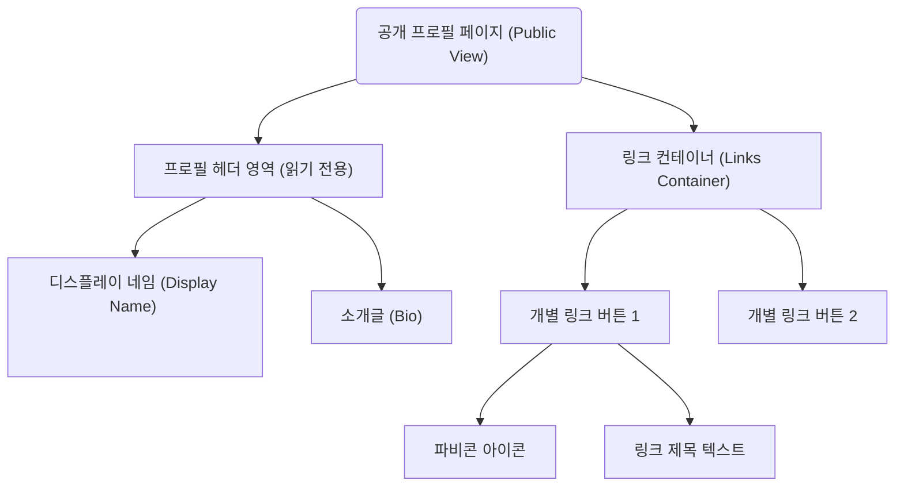

# 마이링크 (MyLink) 와이어프레임 설계

마이링크 서비스의 UI/UX 구조를 시각화한 와이어프레임 문서입니다. PRD 및 사용자 시나리오에서 정의된 모든 기능(인라인 편집, 파비콘 노출 등)을 철저히 반영했습니다.

---

## 1. 공개 프로필 페이지 (Public Profile View)
방문자가 보게 되는 퍼블릭 뷰 화면입니다. 모바일 기기에 최적화된(Mobile First) 간결한 세로형 뷰를 제공합니다. **이 화면에서는 어떠한 편집이나 수정 UI(연필 아이콘 등)도 일절 노출되지 않습니다.**

### 아스키 아트 와이어프레임 (ASCII Art)
```text
+---------------------------------------------+
|                                             |
|              [홍길동 홍보대사]              |
|                                             |
|     안녕하세요, 세상을 바꾸는 크리에이터    |
|             홍길동의 링크입니다!            |
|                                             |
|                                             |
|  +---------------------------------------+  |
|  |  ( )  YouTube 채널                   >|  |
|  +---------------------------------------+  |
|  |  ( )  개인 기술 블로그               >|  |
|  +---------------------------------------+  |
|  |  ( )  인스타그램 구경하기            >|  |
|  +---------------------------------------+  |
|                                             |
+---------------------------------------------+
※ ( ) : Google Favicon API에서 불러온 고유 아이콘 노출 영역
※  >  : 외부 링크 이동 표시
※ 최상단: `[DisplayName]` 노출 영역 (예: 홍길동 홍보대사)
```

### 뷰 컴포넌트 구조도 (Mermaid)


---

## 2. 관리자 마이페이지 (Admin/Owner View)
소유자 본인만 접근 가능한 관리 화면(마이페이지)입니다. **프로필과 링크를 수정할 수 있는 편집 기능(✏️)은 오직 이 마이페이지 화면 안에서만 활성화됩니다.**

### 아스키 아트 와이어프레임 (ASCII Art)
```text
+---------------------------------------------+
| [MyLink 로고]   [내 페이지 보기] [로그아웃] |
+---------------------------------------------+
|                                             |
|  내 프로필 설정                             |
|  -----------------------------------------  |
|                                             |
|  [홍길동 홍보대사] ✏️                       |
|  [안녕하세요, 세상을 바꾸는 크리에이터...] ✏️ |
|                                             |
|                                             |
|  나의 링크 목록                             |
|  -----------------------------------------  |
|  [           + 새 링크 추가              ]  |
|                                             |
|  +---------------------------------------+  |
|  | URL: [ https://youtube.com/my...] ✏️  |  |
|  | 제목: [ YouTube 채널            ] ✏️  | [🗑]|
|  +---------------------------------------+  |
|                                             |
|  +---------------------------------------+  |
|  | URL: [ https://blog.my.com/...] ✏️    |  |
|  | 제목: [ 개인 기술 블로그        ] ✏️  | [🗑]|
|  +---------------------------------------+  |
|                                             |
+---------------------------------------------+
※ 우측 상단 고정: `[내 페이지 보기]` 구역을 상단 메뉴에 고정하여 언제나 퍼블릭 뷰로 이동 가능하게 배치
※ ✏️: 텍스트를 클릭 시 폼 없이 즉각 입력 가능한 [인라인 편집] 상태 진입
※ 🗑: 클릭 시 '정말 삭제할까요?' 경고 모달 노출 후 삭제 처리
```

### 대시보드 기능 흐름도 (Mermaid)
```mermaid
flowchart TB
    subgraph TopNav[상단 고정 네비게이션]
        Logo("마이링크 로고")
        ViewMyPage("내 페이지 보기 (우측 상단 고정)")
        Logout("로그아웃 버튼")
    end
    
    subgraph ProfileManage[내 프로필 관리 영역 (마이페이지 전용)]
        InlineEdit_Title["디스플레이네임 인라인 텍스트 ✏️ <br/>(클릭 시 input 전환)"]
        InlineEdit_Bio["바이오 인라인 텍스트 ✏️ <br/>(클릭 시 textarea 전환)"]
    end
    
    subgraph LinkManage[나의 링크 관리 영역 (마이페이지 전용)]
        AddBtn["[ + 새 링크 추가 ] 버튼"]
        
        subgraph LinkItem["개별 링크 수정 블록 (컴포넌트)"]
            Favicn_Preview("현재 URL 파비콘 미리보기")
            URL_Edit["연결 URL 인라인 영역 ✏️"]
            Title_Edit["노출 제목 인라인 영역 ✏️"]
            DeleteBtn["삭제(휴지통) 버튼 🗑"]
        end
    end

    TopNav --> ProfileManage
    ViewMyPage -- "클릭 시 새 창에서 퍼블릭 뷰로 이동" --> PublicLink(방문자용 퍼블릭 뷰)
    ProfileManage --> LinkManage
    AddBtn -- "클릭 시 컨테이너에 새 블록 추가" --> LinkItem
    DeleteBtn -. "확인 팝업 창 호출" .-> AlertPopup[삭제 확인 모달 창]
```
